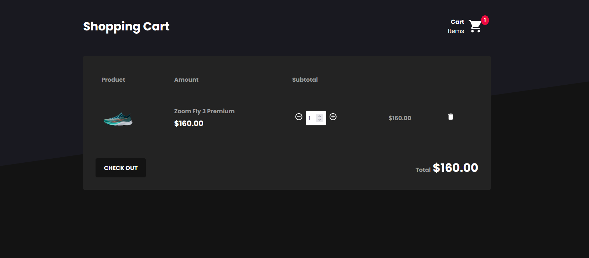

# Shoes-Point 👢
A top-notch shoe store with excellent UI 🛍

##### HomePage


###### CartPage


<p align="center">
  Application built with ReactJs, Redux, Redux Saga, Styled Components and Restful API with JSON Server.
</p>

## Demo 

👉 [Link to demo](https://shoes-point.netlify.app/)

## Tech 👨‍💻

- [ReactJs](https://reactjs.org) - A JavaScript library for building user interfaces.
- [React Icons](https://styled-components.com/) - Utilizes ES6 imports that allows you to include only the icons that your project is using.
- [React Router Dom](https://github.com/ReactTraining/react-router/tree/master/packages/react-router-dom) - DOM bindings.
- [React Redux](https://redux.js.org/basics/usage-with-react) - State container for JavaScript applications.
- [React Redux Saga](https://redux-saga.js.org/) - Library that aims to make application side effects.
- [React Toastify](https://github.com/fkhadra/react-toastify) - React notification.
- [React Reactotron](https://github.com/infinitered/reactotron) - A development tool to explore, inspect, and diagnosis your React DOM/JS apps.
- [Styled Components](https://eslint.org) - ES6 and CSS to styled components.
- [Axios](https://github.com/axios/axios) - Promise based HTTP client for the browser and NodeJs.
- [Immer](https://github.com/immerjs/immer) - Immutability the easy way.
- [JSON Server](https://github.com/typicode/json-server) - Fake REST API.

## Local development

### Prerequisites

To run this project in the development mode, you'll need to have a basic environment with NodeJs and Yarn installed.

#### Cloning the Repository

```
git clone https://github.com/mahamudm90/shoes-point.git
```

### Installing

Run to install the dependencies:

```
yarn
```

To start the project:

```
yarn start
```

To start the JSON Server:

```
yarn dev:server
```

_or_

```
yarn json-server server.json  -p 3333 -w
```

